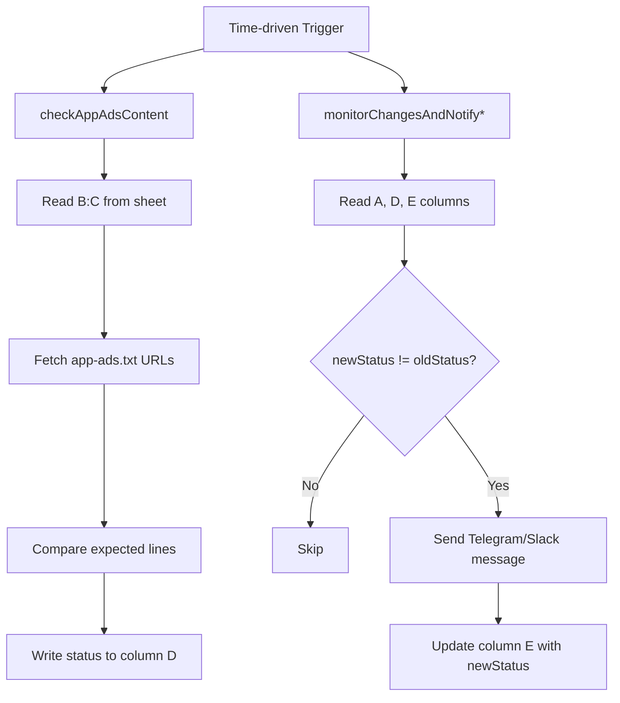

# GAP Check App Ads Content

A Google Apps Script-based monitoring library that validates remote `app-ads.txt` content from Google Sheets and dispatches change alerts to Telegram or Slack.

[](LICENSE)
[](#tech-stack--architecture)
[](#deployment)
[](#usage)

> [!IMPORTANT]
> This repository is built for Google Apps Script runtime and is designed to execute inside a Google Spreadsheet-bound script project.

## Table of Contents

- [Title and Description](#gap-check-app-ads-content)
- [Features](#features)
- [Tech Stack & Architecture](#tech-stack--architecture)
  - [Core Stack](#core-stack)
  - [Project Structure](#project-structure)
  - [Key Design Decisions](#key-design-decisions)
- [Getting Started](#getting-started)
  - [Prerequisites](#prerequisites)
  - [Installation](#installation)
- [Testing](#testing)
- [Deployment](#deployment)
- [Usage](#usage)
  - [1) Validate `app-ads.txt` content](#1-validate-app-adstxt-content)
  - [2) Notify changes to Telegram](#2-notify-changes-to-telegram)
  - [3) Notify changes to Slack](#3-notify-changes-to-slack)
- [Configuration](#configuration)
  - [Spreadsheet Schema](#spreadsheet-schema)
  - [Script Constants](#script-constants)
  - [Execution Triggers](#execution-triggers)
- [License](#license)
- [Contacts & Community Support](#contacts--community-support)

## Features

- Batch-validates `app-ads.txt` endpoints listed in a spreadsheet.
- Uses HTTP status-aware fetch logic (`200` pass-through, non-`200` status reporting).
- Compares expected text lines against remote content with newline-based parsing.
- Tracks per-row validation status in a dedicated output column.
- Detects status deltas between the current and prior execution snapshots.
- Supports Telegram alerting via Bot API integration.
- Supports Slack alerting via Incoming Webhook integration.
- Minimizes write operations with batched `setValues` for history updates.
- Uses idempotent comparison flow (`newStatus` vs `oldStatus`) to reduce noise.
- Handles fetch exceptions and logs runtime errors for observability.

> [!NOTE]
> The checker logic reads expected directives from one cell and splits by newline (`\n`), allowing each expected `app-ads.txt` rule to be maintained on a separate line.

## Tech Stack & Architecture

### Core Stack

- **Runtime:** Google Apps Script (V8 JavaScript runtime).
- **Host Application:** Google Sheets (bound-script execution model).
- **Core APIs:**
  - `SpreadsheetApp` for tabular I/O.
  - `UrlFetchApp` for HTTP requests.
  - `Logger` for execution logs.
- **External Integrations:**
  - Telegram Bot API (`sendMessage`).
  - Slack Incoming Webhooks.

### Project Structure

```text
.
├── checkAppAdsContent.gs             # Core validator: fetch and verify app-ads.txt lines
├── SHEETSmonitorChangesAndNotify.gs  # Change detector + Telegram notifier
├── SLACKmonitorChangesAndNotify.gs   # Change detector + Slack notifier
└── LICENSE                           # Apache License 2.0
```

### Key Design Decisions

- **Spreadsheet-first orchestration:** configuration and state history are stored directly in sheet columns for non-developer operability.
- **Separation of concerns:** validation and notification logic are split into distinct scripts for maintainability.
- **Diff-based notifications:** alerts only trigger when status transitions are detected.
- **Batch writes:** status history updates are buffered to reduce Apps Script API calls.



> [!TIP]
> Keep validation and notification functions on separate time-based triggers. This allows independent schedule tuning (e.g., run validation every 15 minutes, notifications every 5 minutes).

## Getting Started

### Prerequisites

- Google account with access to Google Sheets.
- A spreadsheet containing monitoring rows.
- Google Apps Script editor access.
- For Telegram alerts:
  - Bot token from BotFather.
  - Target chat ID.
- For Slack alerts:
  - Slack Incoming Webhook URL.

### Installation

1. Clone this repository:

```bash
git clone https://github.com/<your-org>/GAP_checkAppAdsContent.git
cd GAP_checkAppAdsContent
```

2. Create or open your target Google Spreadsheet.
3. Open **Extensions → Apps Script**.
4. Copy script contents from:
   - `checkAppAdsContent.gs`
   - `SHEETSmonitorChangesAndNotify.gs`
   - `SLACKmonitorChangesAndNotify.gs`
5. Save the project.
6. Replace secrets/constants in notifier scripts (`TELEGRAM_TOKEN`, `CHAT_ID`, `SLACK_WEBHOOK_URL`).
7. Configure time-driven triggers for your selected functions.

> [!WARNING]
> The repository stores placeholder credentials. Never commit real secrets into version control. Use Apps Script Properties Service for production-grade secret management.

## Testing

This project is script-runtime-centric (Google Apps Script), so validation is primarily done through Apps Script execution logs and sheet-state assertions.

Recommended checks:

```bash
# Optional static syntax check if clasp is configured
clasp pull

# Review repository status before deployment
git status
```

Runtime validation checklist:

1. Execute `checkAppAdsContent` manually once from Apps Script editor.
2. Verify column `D` is populated with one of:
   - `Valid`
   - `Missing: ...`
   - `Error: HTTP <code>`
   - `Error: <message>`
3. Execute `monitorChangesAndNotify` (Telegram) or `monitorChangesAndNotifySlack` (Slack).
4. Confirm outbound alert delivery and that column `E` mirrors new status values.

> [!CAUTION]
> If column `E` is manually edited or cleared, the next notifier run may generate a notification burst because all rows appear as changed.

## Deployment

Production deployment options:

- **Bound script in Google Sheets (recommended):** easiest operational model for spreadsheet-driven workflows.
- **Versioned Apps Script deployments:** create immutable versions for rollback safety.
- **CI-assisted sync with `clasp`:** push script changes from GitHub workflows to Apps Script project (advanced).

Suggested production workflow:

1. Update code in Git.
2. Run peer review.
3. Sync to Apps Script project.
4. Create a versioned deployment.
5. Monitor execution logs and quota usage.

Example Dockerized CI helper for `clasp`-based pipelines:

```yaml
# docker-compose.yml (example)
services:
  clasp:
    image: node:20-alpine
    working_dir: /repo
    volumes:
      - ./:/repo
    command: sh -c "npm i -g @google/clasp && clasp push"
```

> [!NOTE]
> For enterprise environments, prefer non-interactive auth with dedicated service credentials and secure secret injection from your CI platform.

## Usage

### 1) Validate `app-ads.txt` content

```javascript
function runValidation() {
  // Reads URLs from column B and expected directives from column C
  // Writes validation status to column D
  checkAppAdsContent();
}
```

Expected behavior:

- Every row is fetched from URL in column `B`.
- Expected rules in column `C` are split by newline.
- Missing lines are aggregated into a single status message.

### 2) Notify changes to Telegram

```javascript
function runTelegramMonitor() {
  // Compares current status (D) against previous status snapshot (E)
  // Sends Telegram alerts only when a row transitions
  monitorChangesAndNotify();
}
```

### 3) Notify changes to Slack

```javascript
function runSlackMonitor() {
  // Compares status deltas and emits Slack webhook notifications
  monitorChangesAndNotifySlack();
}
```

## Configuration

### Spreadsheet Schema

| Column | Purpose | Required | Example |
|---|---|---:|---|
| `A` | Site URL / Display label for notifications | Yes | `https://example.com` |
| `B` | `app-ads.txt` URL to fetch | Yes | `https://example.com/app-ads.txt` |
| `C` | Expected lines (`\n` separated) | Yes | `google.com, pub-123, DIRECT` |
| `D` | Current validation status (managed by script) | Yes | `Valid` |
| `E` | Previous status snapshot (managed by notifier) | Yes | `Valid` |

### Script Constants

- In `SHEETSmonitorChangesAndNotify.gs`:
  - `TELEGRAM_TOKEN`
  - `CHAT_ID`
- In `SLACKmonitorChangesAndNotify.gs`:
  - `SLACK_WEBHOOK_URL`
- In all scripts:
  - `sheetName` (currently `test1`)

### Execution Triggers

Recommended schedule:

- `checkAppAdsContent`: every 15-60 minutes.
- `monitorChangesAndNotify` / `monitorChangesAndNotifySlack`: every 5-15 minutes.

> [!IMPORTANT]
> Keep trigger frequency within Google Apps Script quotas and external API rate limits.

## License

This project is licensed under the **Apache License 2.0**. See [LICENSE](LICENSE) for full legal terms.

## Contacts & Community Support

## Support the Project

[](https://www.patreon.com/OstinFCT)
[](https://ko-fi.com/fctostin)
[](https://boosty.to/ostinfct)
[](https://www.youtube.com/@FCT-Ostin)
[](https://t.me/FCTostin)

If you find this tool useful, consider leaving a star on GitHub or supporting the author directly.
